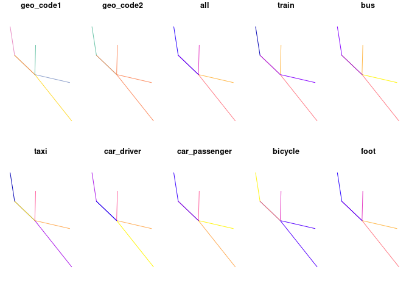

<!-- README.md is generated from README.Rmd. Please edit that file -->

# od

<!-- badges: start -->
<!-- [](https://lifecycle.r-lib.org/articles/stages.html) -->

[](https://itsleeds.github.io/od/)
[](https://github.com/r-hub/cranlogs.app)
[](https://codecov.io/gh/itsleeds/od?branch=master)
[](https://github.com/itsleeds/od/actions)
[](https://cran.r-project.org/package=od)
[](https://github.com/itsleeds/od/actions)
<!-- badges: end -->

The goal of od is to provide functions and example datasets for working
with origin-destination (OD) datasets. OD datasets represent “the volume
of travel between zones or locations” (Carey et
al. [1981](https://doi.org/10.1287/trsc.15.1.32)) and are central to
modelling city to global scale transport systems (Simini et
al. [2012](https://doi.org/10.1038/nature10856)).

## Installation

You can install the released version of od from
[CRAN](https://CRAN.R-project.org) with:

``` r
install.packages("od")
```

Install the development version from [GitHub](https://github.com/) with:

``` r
# install.packages("devtools")
devtools::install_github("itsleeds/od", build_vignettes = TRUE)
```

The examples below provide a gentle introduction to the package. For a
more detailed introduction to the package and OD data in general, see
the [`od` vignette online at
itsleeds.github.io/od](https://itsleeds.github.io/od/articles/od.html)
or by executing the following command after installing the package:

``` r
vignette("od")
```

You can find descriptions of each of the package’s functions with
reproducible examples on the package’s web page:
<https://itsleeds.github.io/od/reference/index.html>

## Motivation

The package originated as a set of functions in the package `stplanr`
for working with origin-destination data. The `od2line()` function, for
example, takes a data frame and a spatial object as inputs and outputs
geographic lines representing movement between origins and destinations:

``` r
library(od) # load example datasets
od_data_df # OD data as data frame
#>   geo_code1 geo_code2  all train bus taxi car_driver car_passenger bicycle foot
#> 1 E02002384 E02006875  966    14 153   14         69            18      13  679
#> 2 E02002404 E02006875 1145     6 174   17         96            38      10  798
#> 3 E02006875 E02006875 1791    21  38    5         69             7       8 1637
#> 4 E02006876 E02006875 1035    11 132    6         97            24      10  749
#> 5 E02006861 E02002392  453     1  51    0         51             6      26  317
#> 6 E02006875 E02002392  286     2  15    5         16             2      10  235
#> 7 E02002392 E02006875  753    10  91   21         33             7      19  571
od_data_centroids[1:2, ]
#>    geo_code             geometry
#> 1 E02002407 -1.609934, 53.790790
#> 2 E02002336   -1.62463, 53.88605
desire_lines_stplanr = stplanr::od2line(od_data_df, od_data_centroids)
desire_lines_stplanr[1:2, 1:9]
#> Simple feature collection with 2 features and 9 fields
#> Geometry type: LINESTRING
#> Dimension:     XY
#> Bounding box:  xmin: -1.545708 ymin: 53.7923 xmax: -1.518911 ymax: 53.80925
#> Geodetic CRS:  WGS 84
#>   geo_code1 geo_code2  all train bus taxi car_driver car_passenger bicycle
#> 1 E02002384 E02006875  966    14 153   14         69            18      13
#> 2 E02002404 E02006875 1145     6 174   17         96            38      10
#>                         geometry
#> 1 LINESTRING (-1.545094 53.80...
#> 2 LINESTRING (-1.518911 53.79...
```

It works great, and is plenty fast enough for most applications, but
there are some issues with `stplanr::od2line()` (which also affect the
other `od_*()` functions in `stplanr`):

-   The function is a commonly needed and low-level function, buried in
    a large package, reducing ‘findability’
-   To get the function you must install `stplanr` plus its numerous
    dependencies
-   The function has not been optimised
-   It has no class definition of ‘od’ data

The `od` package addresses the first three of these issues (it may at
some point define a class for `od` objects but there are no immediate
plans to do so).

The equivalent code in the `od` package is as follows:

``` r
desire_lines_od = od_to_sf(od_data_df, od_data_centroids)
#> 0 origins with no match in zone ids
#> 0 destinations with no match in zone ids
#>  points not in od data removed.
```

The result is an `sfc` object that has the same geometry as the output
from `od2line`:

``` r
desire_lines_od$geometry[1:2]
#> Geometry set for 2 features 
#> Geometry type: LINESTRING
#> Dimension:     XY
#> Bounding box:  xmin: -1.545708 ymin: 53.7923 xmax: -1.518911 ymax: 53.80925
#> Geodetic CRS:  WGS 84
#> LINESTRING (-1.545094 53.80925, -1.545708 53.79...
#> LINESTRING (-1.518911 53.7923, -1.545708 53.79593)
desire_lines_stplanr$geometry[1:2]
#> Geometry set for 2 features 
#> Geometry type: LINESTRING
#> Dimension:     XY
#> Bounding box:  xmin: -1.545708 ymin: 53.7923 xmax: -1.518911 ymax: 53.80925
#> Geodetic CRS:  WGS 84
#> LINESTRING (-1.545094 53.80925, -1.545708 53.79...
#> LINESTRING (-1.518911 53.7923, -1.545708 53.79593)
```

These are ‘desire lines’ representing the shortest (straight line) path
between two centroids and can plotted using geographic data and mapping
packages such as `sf`, `mapview`, `tmap` and `mapdeck`, e.g.:

``` r
plot(desire_lines_od)
plot(desire_lines_stplanr$geometry)
```



By default the package uses the `sfheaders` package to create `sf`
objects for speed. You can can also specify `sf` outputs as follows:

``` r
desire_lines_od_sf1 = od_to_sf(od_data_df, od_data_centroids)
#> 0 origins with no match in zone ids
#> 0 destinations with no match in zone ids
#>  points not in od data removed.
```

## Performance

### Benchmark on a small dataset:

``` r
nrow(od_data_df)
#> [1] 7
bench::mark(check = FALSE, max_iterations = 100,
  stplanr = stplanr::od2line(od_data_df, od_data_zones),
  od = od_to_sfc(od_data_df, od_data_zones),
  od_sf1 = od_to_sf(od_data_df, od_data_zones),
  od_sf2 = od_to_sf(od_data_df, od_data_zones, package = "sf", crs = 4326)
)
#> # A tibble: 4 x 6
#>   expression      min   median `itr/sec` mem_alloc `gc/sec`
#>   <bch:expr> <bch:tm> <bch:tm>     <dbl> <bch:byt>    <dbl>
#> 1 stplanr      5.12ms   5.84ms      171.   607.1KB     4.16
#> 2 od           2.49ms   2.73ms      358.    78.1KB     3.62
#> 3 od_sf1       3.62ms   4.07ms      241.    77.8KB     4.92
#> 4 od_sf2       3.53ms   4.02ms      246.    90.5KB     5.01
```

## Related open source projects

-   [stplanr](https://github.com/ropensci/stplanr/) is an R package
    package designed to support transport planning, with a focus on
    geographic transport datasets and many functions for working with OD
    data in the [od function
    family](https://docs.ropensci.org/stplanr/reference/index.html#section-work-with-od-data).
-   [cartography](https://riatelab.github.io/cartography/) is an R
    package with functions for working with OD data, including
    [`getLinkLayer()`](https://riatelab.github.io/cartography/docs/reference/getLinkLayer.html)
-   [gravity](https://pacha.dev/gravity/) is an R package for developing
    ‘gravity models’ to estimate flow between zones
-   [flowmap.gl](https://github.com/teralytics/flowmap.gl), a JavaScript
    package for visualising OD data
-   [Arabesque](http://arabesque.ifsttar.fr/) is another JavaScript
    project for working with OD data

## Code of Conduct

Please note that the od project is released with a [Contributor Code of
Conduct](https://contributor-covenant.org/version/2/0/CODE_OF_CONDUCT.html).
By contributing to this project, you agree to abide by its terms.
