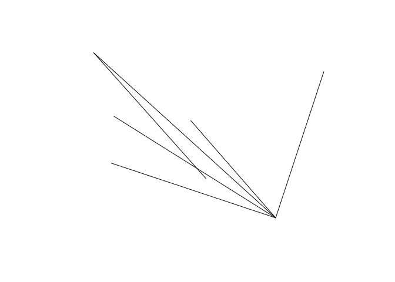
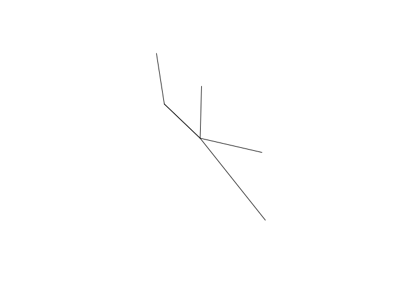

<!-- README.md is generated from README.Rmd. Please edit that file -->

# od

<!-- badges: start -->

[](https://itsleeds.github.io/od/)
[](https://www.tidyverse.org/lifecycle/#experimental)
[](https://codecov.io/gh/itsleeds/od?branch=master)
[](https://github.com/itsleeds/od/actions)
<!-- badges: end -->

The goal of od is to provide functions and example datasets for working
with origin-destination (OD) datasets. OD datasets represent “the volume
of travel between zones or locations” (Carey et
al. [1981](https://doi.org/10.1287/trsc.15.1.32)) and are central to
modelling city to global scale transport systems (Simini et
al. [2012](https://doi.org/10.1038/nature10856)).

## Installation

<!-- You can install the released version of od from [CRAN](https://CRAN.R-project.org) with: 

``` r
install.packages("od")
```

And the development version from [GitHub](https://github.com/) with:

-->

``` r
# install.packages("devtools")
devtools::install_github("itsleeds/od")
```

## Motivation

The package originated as a set of functions in the package `stplanr`
for working with origin-destination data. The `od2line()` function, for
example, takes a data frame and a spatial object as inputs and outputs
geographic lines representing movement between origins and destinations:

``` r
library(od) # load example datasets
od_data_df # OD data as data frame
#>   geo_code1 geo_code2  all train bus taxi car_driver car_passenger bicycle foot
#> 1 E02002363 E02006875  922     5 356    7        375            76      43   53
#> 2 E02002373 E02006875 1037   111 424   20        155            30      73  214
#> 3 E02002385 E02006875  958   121 334   19        118            25      52  283
#> 4 E02006852 E02002392  437     1  96    3        142            26      61  108
#> 5 E02006852 E02006875 1221    14 509   13        401            50      99  118
#> 6 E02006861 E02006875 1177    43 400   30        123            28      56  492
od_data_centroids[1:2, ]
#>    geo_code             geometry
#> 1 E02002407 -1.609934, 53.790790
#> 2 E02002336   -1.62463, 53.88605
desire_lines_stplanr = stplanr::od2line(od_data_df, od_data_centroids)
desire_lines_stplanr[1:2, 1:9]
#> Simple feature collection with 2 features and 9 fields
#> geometry type:  LINESTRING
#> dimension:      XY
#> bbox:           xmin: -1.581773 ymin: 53.79593 xmax: -1.534957 ymax: 53.82859
#> geographic CRS: WGS 84
#>   geo_code1 geo_code2  all train bus taxi car_driver car_passenger bicycle
#> 1 E02002363 E02006875  922     5 356    7        375            76      43
#> 2 E02002373 E02006875 1037   111 424   20        155            30      73
#>                         geometry
#> 1 LINESTRING (-1.534957 53.82...
#> 2 LINESTRING (-1.581773 53.81...
```

It works great, and is plenty fast enough for most applications, but
there are some issues with `stplanr::od2line()` (which also affect the
other `od_*()` functions in `stplanr`):

  - The function is a commonly needed and low-level function, buried in
    a large package, reducing ‘findability’
  - To get the function you must install `stplanr` plus its numerous
    dependencies
  - The function has not been optimised
  - It has no class definition of ‘od’ data

The `od` package, as it currently stands, addresses the first three of
these issues (it may at some point define a class for `od` objects but
there are no immediate plans to do so).

The equivalent code in the `od` package is as follows:

``` r
desire_lines_od = od_to_sfc(od_data_df, od_data_centroids)
```

The result is an `sfc` object that has the same geometry as the output
from `od2line`:

``` r
desire_lines_od[1:2]
#> Geometry set for 2 features 
#> geometry type:  LINESTRING
#> dimension:      XY
#> bbox:           xmin: -1.581773 ymin: 53.79593 xmax: -1.534957 ymax: 53.82859
#> geographic CRS: WGS 84
#> LINESTRING (-1.534957 53.82859, -1.545708 53.79...
#> LINESTRING (-1.581773 53.8186, -1.545708 53.79593)
desire_lines_stplanr$geometry[1:2]
#> Geometry set for 2 features 
#> geometry type:  LINESTRING
#> dimension:      XY
#> bbox:           xmin: -1.581773 ymin: 53.79593 xmax: -1.534957 ymax: 53.82859
#> geographic CRS: WGS 84
#> LINESTRING (-1.534957 53.82859, -1.545708 53.79...
#> LINESTRING (-1.581773 53.8186, -1.545708 53.79593)
```

These are ‘desire lines’ representing the shortest (straight line) path
between two centoids and can plotted using geographic data and mapping
packages such as `sf`, `mapview`, `tmap` and `mapdeck`, e.g.:

``` r
plot(desire_lines_od)
plot(desire_lines_stplanr$geometry)
```



By default the package uses the `sfheaders` package to create sf
objects. You can can also specify `sf` outputs as follows:

``` r
desire_lines_od_sf1 = od_to_sf(od_data_df, od_data_centroids)
#> 0 origins with no match in zone ids
#> 0 destinations with no match in zone ids
#>  points not in od data removed.
```

## Performance

The package is designed to be fast, with centroids only created when
needed and the use of `sfheaders`.

### Benchmark on a small dataset:

``` r
nrow(od_data_df)
#> [1] 6
bench::mark(check = FALSE, max_iterations = 100,
  stplanr = stplanr::od2line(od_data_df, od_data_zones),
  od = od_to_sfc(od_data_df, od_data_zones),
  od_sf1 = od_to_sf(od_data_df, od_data_zones),
  od_sf2 = od_to_sf(od_data_df, od_data_zones, package = "sf", crs = 4326)
)
#> # A tibble: 4 x 6
#>   expression      min   median `itr/sec` mem_alloc `gc/sec`
#>   <bch:expr> <bch:tm> <bch:tm>     <dbl> <bch:byt>    <dbl>
#> 1 stplanr      6.15ms   6.62ms      148.   600.5KB     11.9
#> 2 od           3.02ms   3.26ms      297.    78.2KB     12.4
#> 3 od_sf1       4.32ms   4.59ms      213.    77.8KB     11.2
#> 4 od_sf2       4.26ms   4.58ms      210.    90.8KB     11.1
```

## Related open source projects

  - [stplanr](https://github.com/ropensci/stplanr/) is an R package
    package designed to support transport planning, with a focus on
    geographic transport datasets and many functions for working with OD
    data in the [od function
    family](https://docs.ropensci.org/stplanr/reference/index.html#section-work-with-od-data).
  - [cartography](https://riatelab.github.io/cartography/) is an R
    package with functions for working with OD data, including
    [`getLinkLayer()`](https://riatelab.github.io/cartography/docs/reference/getLinkLayer.html)
  - [gravity](https://pacha.dev/gravity/) is an R package for developing
    ‘gravity models’ to estimate flow between zones
  - [flowmap.gl](https://github.com/teralytics/flowmap.gl), a JavaScript
    package for visualising OD data
  - [Arabesque](https://github.com/gflowiz) is another JavaScript
    project for working with OD data

## Code of Conduct

Please note that the od project is released with a [Contributor Code of
Conduct](https://contributor-covenant.org/version/2/0/CODE_OF_CONDUCT.html).
By contributing to this project, you agree to abide by its terms.
