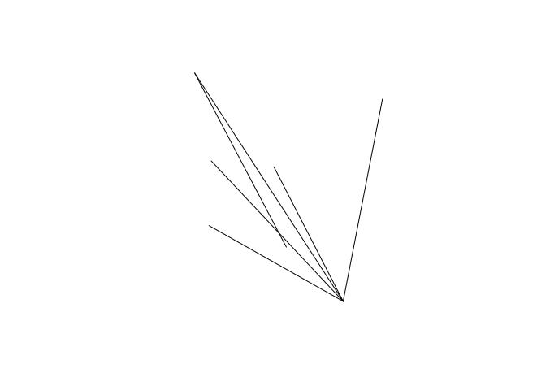

<!-- README.md is generated from README.Rmd. Please edit that file -->

# od

<!-- badges: start -->

<!-- badges: start -->

[](https://travis-ci.org/itsleeds/od)
<!-- [](https://ci.appveyor.com/project/itsleeds/od) -->
<!-- [](https://circleci.com/gh/itsleeds/od) -->
[](https://cran.r-project.org/package=tic)
<!-- [](https://codecov.io/gh/itsleeds/od) -->
[](https://www.tidyverse.org/lifecycle/#experimental)
<!-- badges: end -->

<!-- badges: end -->

The goal of od is to provide tools and example datasets for working with
origin-destination (OD) datasets.

## Installation

<!-- You can install the released version of od from [CRAN](https://CRAN.R-project.org) with: 

``` r
install.packages("od")
```

And the development version from [GitHub](https://github.com/) with:

-->

``` r
# install.packages("devtools")
devtools::install_github("itsleeds/od")
```

## Motivation

The package originated as a set of functions in the package `stplanr`
for working with origin-destination data. The `od2line()` function, for
example, takes a data frame and a spatial object as inputs and outputs
geographic lines representing movement between origins and destinations:

``` r
library(od) # load example datasets
od_data_df # OD data as data frame
#>   geo_code1 geo_code2  all train bus taxi car_driver car_passenger bicycle foot
#> 1 E02002363 E02006875  922     5 356    7        375            76      43   53
#> 2 E02002373 E02006875 1037   111 424   20        155            30      73  214
#> 3 E02002385 E02006875  958   121 334   19        118            25      52  283
#> 4 E02006852 E02002392  437     1  96    3        142            26      61  108
#> 5 E02006852 E02006875 1221    14 509   13        401            50      99  118
#> 6 E02006861 E02006875 1177    43 400   30        123            28      56  492
od_data_centroids[1:2, ]
#>    geo_code             geometry
#> 1 E02002407 -1.609934, 53.790790
#> 2 E02002336   -1.62463, 53.88605
desire_lines_stplanr = stplanr::od2line(od_data_df, od_data_centroids)
desire_lines_stplanr[1:2, 1:9]
#> Simple feature collection with 2 features and 9 fields
#> geometry type:  LINESTRING
#> dimension:      XY
#> bbox:           xmin: -1.581773 ymin: 53.79593 xmax: -1.534957 ymax: 53.82859
#> epsg (SRID):    4326
#> proj4string:    +proj=longlat +datum=WGS84 +no_defs
#>   geo_code1 geo_code2  all train bus taxi car_driver car_passenger bicycle
#> 1 E02002363 E02006875  922     5 356    7        375            76      43
#> 2 E02002373 E02006875 1037   111 424   20        155            30      73
#>                         geometry
#> 1 LINESTRING (-1.534957 53.82...
#> 2 LINESTRING (-1.581773 53.81...
```

It works great, and is plenty fast enough for most applications, but
there are some issues with `stplanr::od2line()` (which also affect the
other `od_*()` functions in `stplanr`):

  - The function is a commonly needed and low-level function, buried in
    a large package, reducing ‘findability’
  - To get the function you must install `stplanr` plus its numerous
    dependencies
  - The function has not been optimised
  - It has no class definition of ‘od’ data

The `od` package, as it currently stands, addresses the first three of
these issues (it may at some point define a class for `od` objects but
there are no immediate plans to do so).

The equivalent code in the `od` package is as follows:

``` r
desire_lines_od = od_to_sfc(od_data_df, od_data_centroids)
```

The result is an `sfc` object that has the same geometry as the output
from `od2line`:

``` r
desire_lines_od[1:2]
#> Geometry set for 2 features 
#> geometry type:  LINESTRING
#> dimension:      XY
#> bbox:           xmin: -1.581773 ymin: 53.79593 xmax: -1.534957 ymax: 53.82859
#> epsg (SRID):    NA
#> proj4string:    NA
#> LINESTRING (-1.534957 53.82859, -1.545708 53.79...
#> LINESTRING (-1.581773 53.8186, -1.545708 53.79593)
desire_lines_stplanr$geometry[1:2]
#> Geometry set for 2 features 
#> geometry type:  LINESTRING
#> dimension:      XY
#> bbox:           xmin: -1.581773 ymin: 53.79593 xmax: -1.534957 ymax: 53.82859
#> epsg (SRID):    4326
#> proj4string:    +proj=longlat +datum=WGS84 +no_defs
#> LINESTRING (-1.534957 53.82859, -1.545708 53.79...
#> LINESTRING (-1.581773 53.8186, -1.545708 53.79593)
```

These are ‘desire lines’ representing the shortest (straight line) path
between two centoids and can plotted using geographic data and mapping
packages such as `sf`, `mapview`, `tmap` and `mapdeck`, e.g.:

``` r
plot(desire_lines_od)
plot(desire_lines_stplanr$geometry)
```



To make the results (almost) identical, we can specify `sf` outputs:

``` r
desire_lines_od_sf1 = od_to_sf(od_data_df, od_data_centroids)
desire_lines_od_sf1[1:2, 1:9]
#> Simple feature collection with 2 features and 9 fields
#> geometry type:  LINESTRING
#> dimension:      XY
#> bbox:           xmin: -1.581773 ymin: 53.79593 xmax: -1.534957 ymax: 53.82859
#> epsg (SRID):    NA
#> proj4string:    NA
#>   geo_code1 geo_code2  all train bus taxi car_driver car_passenger bicycle
#> 1 E02002363 E02006875  922     5 356    7        375            76      43
#> 2 E02002373 E02006875 1037   111 424   20        155            30      73
#>                         geometry
#> 1 LINESTRING (-1.534957 53.82...
#> 2 LINESTRING (-1.581773 53.81...
sf::st_crs(desire_lines_od_sf1)
#> Coordinate Reference System: NA
```

An additional option, that requires the `sf` package is to be installed,
is to use sf during the creation of the lines, allowing crss to be
provided:

``` r
desire_lines_od_sf2 = od_to_sf(od_data_df, od_data_centroids, package = "sf", crs = 4326)
sf::st_crs(desire_lines_od_sf2)
#> Coordinate Reference System:
#>   EPSG: 4326 
#>   proj4string: "+proj=longlat +datum=WGS84 +no_defs"
```

## Performance

The package is designed to be fast, with centroids only created when
needed and the use of `sfheaders`.

### Benchmark on a small dataset:

``` r
nrow(od_data_df)
#> [1] 6
bench::mark(check = FALSE, max_iterations = 100,
  stplanr = stplanr::od2line(od_data_df, od_data_zones),
  od = od_to_sfc(od_data_df, od_data_zones),
  od_sf1 = od_to_sf(od_data_df, od_data_zones),
  od_sf2 = od_to_sf(od_data_df, od_data_zones, package = "sf", crs = 4326)
)
#> # A tibble: 4 x 6
#>   expression      min   median `itr/sec` mem_alloc `gc/sec`
#>   <bch:expr> <bch:tm> <bch:tm>     <dbl> <bch:byt>    <dbl>
#> 1 stplanr      3.74ms   3.96ms      253.   593.8KB     10.6
#> 2 od           1.48ms   1.52ms      643.    39.7KB     19.9
#> 3 od_sf1       1.75ms   1.79ms      550.    18.3KB     11.2
#> 4 od_sf2       1.78ms   1.82ms      540.    21.2KB     16.7
```

``` r
bench::mark(check = FALSE, max_iterations = 100,
  stplanr_centroids = stplanr::od2line(od_data_df, od_data_centroids),
  od_sf3 = od_to_sf(od_data_df, od_data_centroids)
  # od_sf4 = od_to_sf(od_data_df, centroids, package = "sf", crs = 4326)
)
#> # A tibble: 2 x 6
#>   expression             min   median `itr/sec` mem_alloc `gc/sec`
#>   <bch:expr>        <bch:tm> <bch:tm>     <dbl> <bch:byt>    <dbl>
#> 1 stplanr_centroids    1.3ms   1.34ms      722.      21KB     14.7
#> 2 od_sf3              1.06ms   1.08ms      902.    10.4KB     18.4
```

### Benchmark on medium-sized dataset

``` r
nrow(od_data_df_medium)
#> [1] 10245
bench::mark(check = FALSE, max_iterations = 100,
  stplanr = stplanr::od2line(od_data_df_medium, od_data_zones),
  od = od_to_sfc(od_data_df_medium, od_data_zones),
  od_sf1 = od_to_sf(od_data_df_medium, od_data_zones),
  od_sf2 = od_to_sf(od_data_df_medium, od_data_zones, package = "sf", crs = 4326)
)
#> Warning: Some expressions had a GC in every iteration; so filtering is disabled.
#> # A tibble: 4 x 6
#>   expression      min   median `itr/sec` mem_alloc `gc/sec`
#>   <bch:expr> <bch:tm> <bch:tm>     <dbl> <bch:byt>    <dbl>
#> 1 stplanr       341ms  343.4ms      2.91    9.13MB     8.73
#> 2 od           24.1ms     25ms     38.4     4.87MB     7.68
#> 3 od_sf1       28.5ms   29.7ms     29.7     5.42MB     5.95
#> 4 od_sf2        341ms  348.2ms      2.87    5.64MB     7.18
```

``` r
bench::mark(check = FALSE, max_iterations = 100,
  stplanr_centroids = stplanr::od2line(od_data_df_medium, od_data_centroids),
  od_sf3 = od_to_sf(od_data_df_medium, od_data_centroids)
  # od_sf4 = od_to_sf(od_data_df_medium, centroids, package = "sf", crs = 4326)
)
#> Warning: Some expressions had a GC in every iteration; so filtering is disabled.
#> # A tibble: 2 x 6
#>   expression             min   median `itr/sec` mem_alloc `gc/sec`
#>   <bch:expr>        <bch:tm> <bch:tm>     <dbl> <bch:byt>    <dbl>
#> 1 stplanr_centroids  379.3ms  381.4ms      2.62    9.03MB    10.5 
#> 2 od_sf3              27.2ms   28.1ms     29.9     5.36MB     5.97
```

### Benchmark using low-level functions and made-up data

``` r
sf_internal = function(x) {
  matrix(
    unlist(x, use.names = FALSE),
    nrow = length(x),
    byrow = TRUE,
    dimnames = list(1:length(x))
  )
}

n = 1e5
df = data.frame(x = rnorm(n),
                y = rnorm(n))

pts = sfheaders::sf_point(obj = df)

sf = sf::st_coordinates(pts)
sfh = sfheaders::sf_to_df(pts)
sfi = sf_internal(pts$geometry)
head(sf)
#>            X           Y
#> 1 -0.7926019 -0.95508049
#> 2  1.4427497 -0.17210975
#> 3 -0.6752244  0.60099582
#> 4 -1.4010203 -0.08182133
#> 5  1.1906365  0.56727967
#> 6 -0.1277217  1.97600713
head(sfh)
#>   sfg_id point_id          x           y
#> 1      1        1 -0.7926019 -0.95508049
#> 2      2        2  1.4427497 -0.17210975
#> 3      3        3 -0.6752244  0.60099582
#> 4      4        4 -1.4010203 -0.08182133
#> 5      5        5  1.1906365  0.56727967
#> 6      6        6 -0.1277217  1.97600713
head(sfi)
#>         [,1]        [,2]
#> 1 -0.7926019 -0.95508049
#> 2  1.4427497 -0.17210975
#> 3 -0.6752244  0.60099582
#> 4 -1.4010203 -0.08182133
#> 5  1.1906365  0.56727967
#> 6 -0.1277217  1.97600713

all.equal(unname(as.matrix(sfh[, c("x", "y")])), unname(sf))
#> [1] TRUE
all.equal(unname(sfi), unname(sf))
#> [1] TRUE

res = bench::press(
  rows = 10 ^ (1:5),
  bench::mark(
    check = FALSE,
    sf = sf::st_coordinates(pts[1:rows, ]),
    sfh = sfheaders::sf_to_df(pts[1:rows, ]),
    sfi = sf_internal(pts[1:rows, ])
  )
)
#> Running with:
#>     rows
#> 1     10
#> 2    100
#> 3   1000
#> 4  10000
#> Warning: Some expressions had a GC in every iteration; so filtering is disabled.
#> 5 100000
#> Warning: Some expressions had a GC in every iteration; so filtering is disabled.

res
#> # A tibble: 15 x 7
#>    expression   rows      min   median `itr/sec` mem_alloc `gc/sec`
#>    <bch:expr>  <dbl> <bch:tm> <bch:tm>     <dbl> <bch:byt>    <dbl>
#>  1 sf             10 793.37µs 849.31µs  1101.       6.36KB     6.21
#>  2 sfh            10 766.77µs 828.31µs  1126.       8.24KB     6.18
#>  3 sfi            10 745.85µs 800.39µs  1163.      39.08KB     8.34
#>  4 sf            100   2.56ms   2.75ms   343.      56.44KB     6.28
#>  5 sfh           100   2.63ms   2.87ms   331.      66.91KB     6.32
#>  6 sfi           100   2.52ms   2.72ms   341.      54.83KB     6.35
#>  7 sf           1000  21.11ms  21.71ms    44.2    474.55KB     6.98
#>  8 sfh          1000  22.16ms  22.83ms    42.2    551.82KB     7.04
#>  9 sfi          1000  21.09ms  21.67ms    44.6    458.88KB     7.43
#> 10 sf          10000 235.54ms 235.57ms     4.15     4.94MB     5.53
#> 11 sfh         10000 261.03ms 262.56ms     3.81     5.67MB     7.62
#> 12 sfi         10000 236.12ms 237.67ms     4.15     4.79MB     5.53
#> 13 sf         100000     2.2s     2.2s     0.454    47.3MB     5.90
#> 14 sfh        100000    2.37s    2.37s     0.422   54.55MB     6.34
#> 15 sfi        100000    2.17s    2.17s     0.461   45.77MB     6.00
# ggplot2::autoplot(res)
```

## Related open source projects

  - [stplanr](https://github.com/ropensci/stplanr/) is an R package
    package designed to support transport planning, with a focus on
    geographic transport datasets and many functions for working with OD
    data in the [od function
    family](https://docs.ropensci.org/stplanr/reference/index.html#section-work-with-od-data).
  - [cartography](http://riatelab.github.io/cartography) is an R package
    with functions for working with OD data, including
    [`getLinkLayer()`](http://riatelab.github.io/cartography/docs/reference/getLinkLayer.html)
  - [gravity](https://pacha.dev/gravity/) is an R package for developing
    ‘gravity models’ to estimate flow between zones
  - [flowmap.gl](https://github.com/teralytics/flowmap.gl), a JavaScript
    package for visualising OD data
  - [Arabesque](http://arabesque.ifsttar.fr/) is another JavaScript
    project for working with OD data
